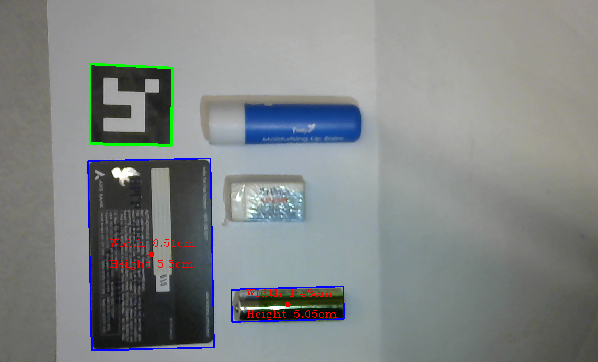

# Object Detection using Aruco Markers

---

This code uses OpenCV to detect objects using ArUco markers. The program captures video feed from the webcam and detects objects based on their size and shape. The detected objects are marked with a rectangular box and the width and height of the objects are displayed on the screen.

## Requirements

- Python 3
- OpenCV
- NumPy

## Important Information

- The dimension of the Aruco marker used for calibration is 3.6cm.
- The battery used is AA battery - 14.5 x 50.5mm.
- Any other objects not within the provided dimension (credit cards and AA battery) with a +/- 3mm precision won't be detected by the code.

## Output

See sample output here 👇:

